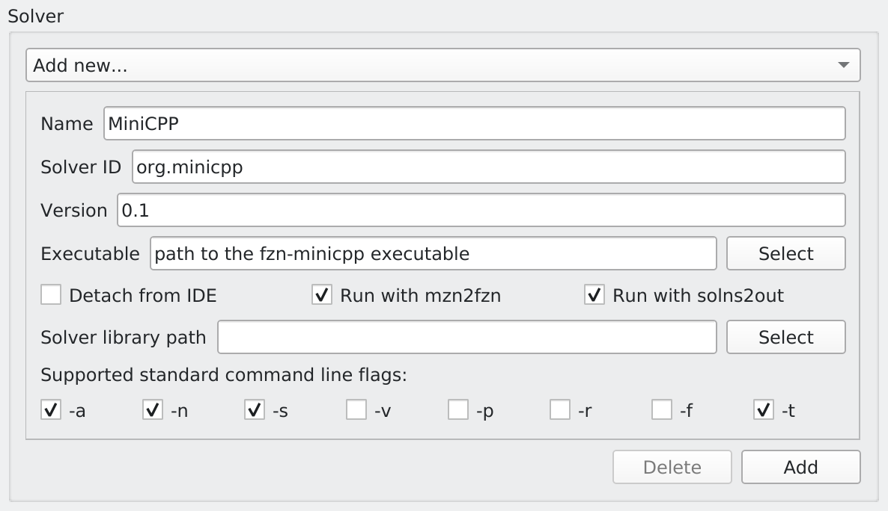

# MiniCPP
A *C++* CP Solver that implements the
[MiniCP](https://bitbucket.org/minicp/minicp/src/master/) API.  The
architecture is identical to [that of MiniCP](http://minicp.org/) and
can be found in the paper [MiniCP: A lightweight solver for constraint
programming](https://link.springer.com/article/10.1007/s12532-020-00190-7)
published in [Mathematical Programming
Computation](https://www.springer.com/journal/12532) and best cited as

	@article{cite-key,
        Author = {Michel, L. and Schaus, P. and Van Hentenryck, P.},
        Doi = {10.1007/s12532-020-00190-7},
        Id = {Michel2021},
        Isbn = {1867-2957},
        Journal = {Mathematical Programming Computation},
        Number = {1},
        Pages = {133-184},
        Title = {MiniCP: a lightweight solver for constraint programming},
        Ty = {JOUR},
        Url = {https://doi.org/10.1007/s12532-020-00190-7},
        Volume = {13},
        Year = {2021}}
 
# MDD Library

MiniCPP includes [Haddock](https://dlnext.acm.org/doi/10.1007/978-3-030-58475-7_31) which is a library for defining
Multi-valued Decision Diagrams. 

	@inproceedings{DBLP:conf/cp/GentzelMH20,
	author    = {Rebecca Gentzel and Laurent Michel and Willem Jan van Hoeve},
	editor    = {Helmut Simonis},
	title     = {{HADDOCK:} {A} Language and Architecture for Decision Diagram Compilation},
	booktitle = {Principles and Practice of Constraint Programming - 26th International
               Conference, {CP} 2020, Louvain-la-Neuve, Belgium, September 7-11,
               2020, Proceedings},
	series    = {Lecture Notes in Computer Science},
	volume    = {12333},
	pages     = {531--547},
	publisher = {Springer},
	year      = {2020},
	url       = {https://doi.org/10.1007/978-3-030-58475-7\_31},
	doi       = {10.1007/978-3-030-58475-7\_31},
	timestamp = {Sat, 09 Apr 2022 12:47:09 +0200},
	biburl    = {https://dblp.org/rec/conf/cp/GentzelMH20.bib},
	bibsource = {dblp computer science bibliography, https://dblp.org}
		}

# Requirements to get started

You will need a recent `g++` / `clang` compiler as well as `cmake`. 

## Basic Compilation

The library is build routinely on macOS 12.14
and one only needs to do the following to get the basics in place:
```
cd <root>
mkdir build
cd build
cmake .. -DCMAKE_BUILD_TYPE=Release
make -j4
```
Where `root` is the folder where you have decompressed the library (or cloned the repository)
You ought to be rewarded with a complete build. Feel free to omit the build type, or use `Debug` as the value
of that environment variable to compile in Debug mode.

## Advanced compilation

- To compile *fzn-minicpp* is enough to have a recent version of a GCC (>= 7) and CMake (>= 3.5).
- To (re)generate the FlatZinc parser is necessary to have a recent version of Flex (>= 2.6) and Bison (>= 3.8).
- To cross-compile and generate Windows binaries is necessary have a modern version of MinGW64 (>= 9.3).


1) Launch the configuration script, for example:
```
./autoCMake.sh -l -r
```
Please see `./autoCmake --help` for all the options.

2) Launch the make process, for example:
```
cd ./cmake-build-linux-release
make fzn-minicpp -j 4
```

# Configure MiniZinc IDE

Select from the toolbar: MiniZinc > Preferences > Solver > Add new. Then configure as follow:




